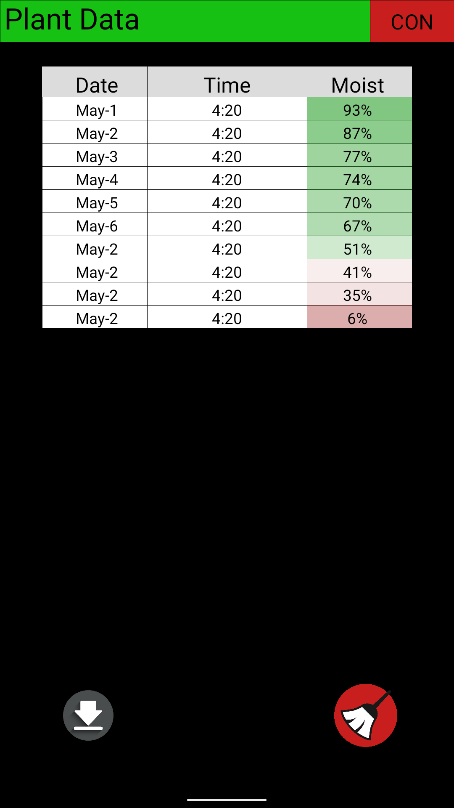
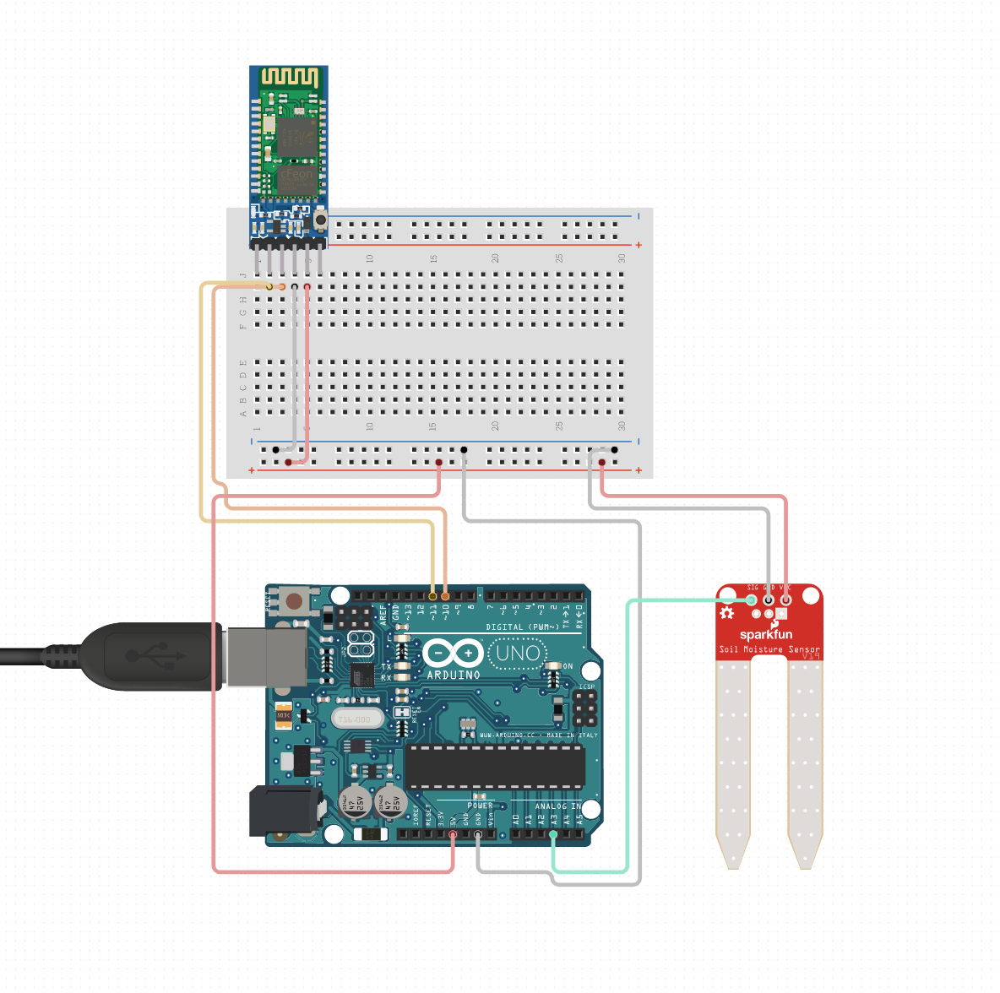

**PlantView**
By Ryan Epp

---
**Features:**
Use a created Processing android app to monitor soil moisture readings over a bluetooth connection. 

**Example:**

**Requirements:**
- A computer that can run Processing3
- A compatible Android device to side-load the app
- Arduino Uno (or any other Arduino board that uses bluetooth)

**Bugs/Needs Improvement:**
- App *could* look better

**Notes:**
Currently the board is set to retrieve soil moisture data every few seconds. While this is useful for debugging, intended use is long term storage underground around a field through battery power. 